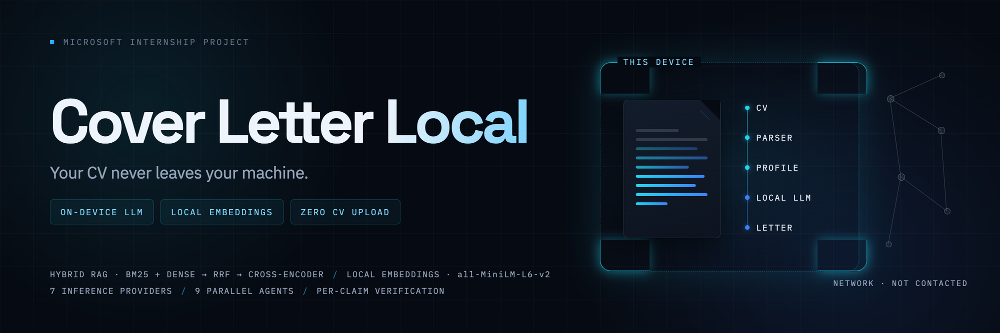
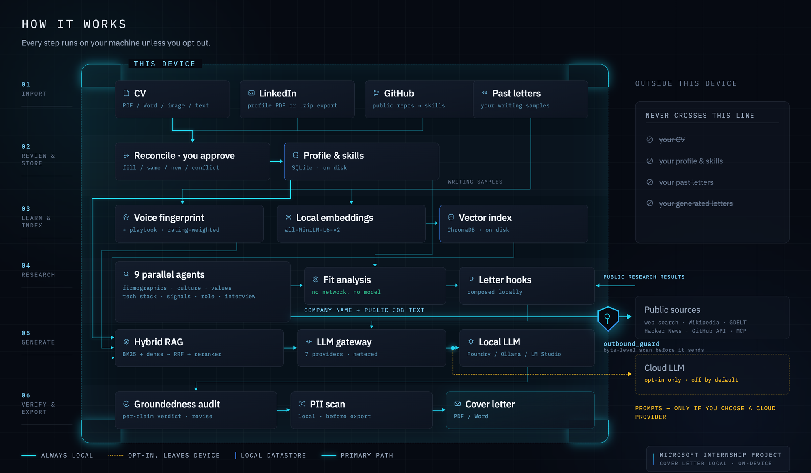
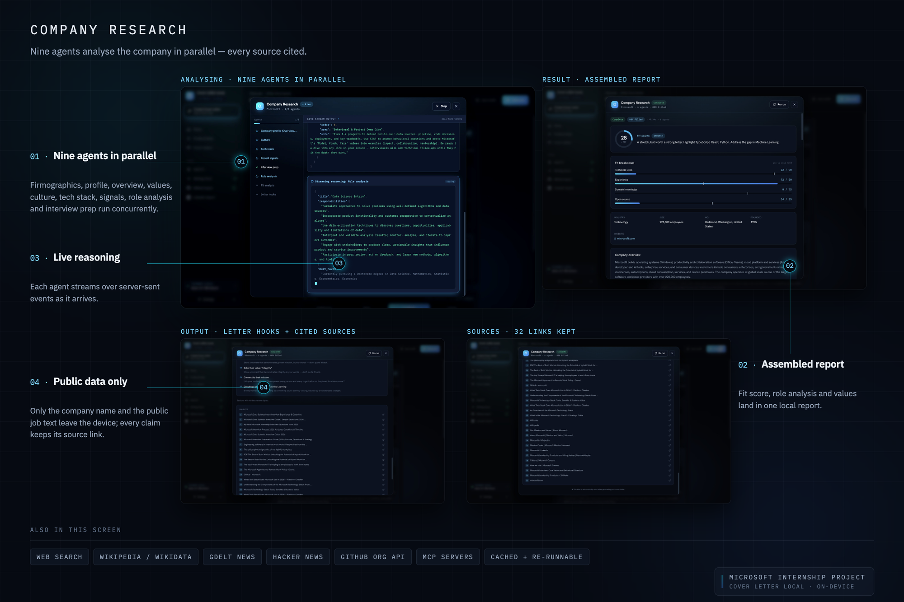
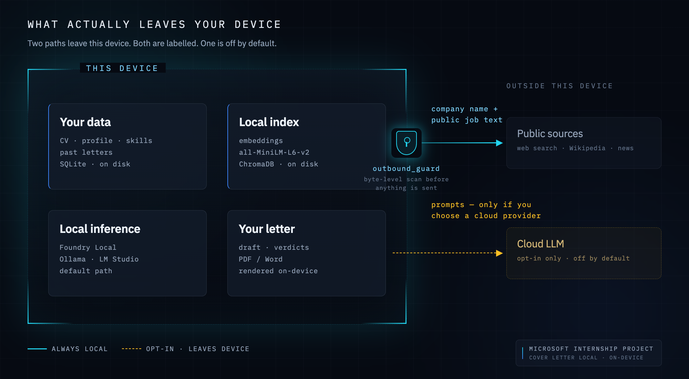

<div align="center">



<br>

[](https://github.com/mehmeterguden/Microsoft-Internship-Cover-Letter-Local/actions/workflows/ci.yml)
[](LICENSE)
[](https://www.python.org/)
[](https://react.dev/)
[](https://github.com/microsoft/Foundry-Local)
[](#-privacy)

**An AI job-application assistant that runs entirely on your own machine.**

It reads your CV, learns how *you* write, researches the company, drafts a cover letter in your
voice — then audits its own output claim by claim. Your personal data never leaves the device.

</div>

---

## Contents

**[Why](#-why-i-built-this)** · **[How it works](#-how-it-works)** · **[Walkthrough](#-walkthrough)** · **[Privacy](#-privacy)** · **[Engineering decisions](#-engineering-decisions--trade-offs)** · **[Responsible AI](#-responsible-ai)** · **[Quick start](#-quick-start)** · **[Stack](#-tech-stack)** · **[Structure](#-project-structure)** · **[Tests](#-testing--ci)** · **[What I learned](#-what-i-learned)**

---

## 🎯 Why I built this

Every AI cover-letter tool asks for the same thing first: **upload your CV**. That single step
hands your full employment history, contact details and career context to a third-party server —
to be logged, retained, and quite possibly trained on. For a document you only wanted help
*phrasing*.

I wanted to find out whether it could work the other way round: **the model comes to your data,
not your data to the model.**

So this runs the whole pipeline locally. The CV is parsed on-device. The writing style is learned
on-device. The retrieval index lives in a local database. Generation runs against a local model —
Microsoft's **Foundry Local** by default. The only thing that ever goes out is a **company name
and the employer's own public job text**, and a byte-level firewall inspects every outgoing
request to prove it.

The interesting engineering question was never *"can an LLM write a cover letter"* — obviously it
can. It was: **how much quality do you give up to keep everything local, and how much of that can
you win back with better engineering instead of a bigger model?**

---

## 🔧 How it works



Six stages, all inside the device boundary. Only two paths ever cross it — one carries a company
name and public job text; the other carries prompts, and only if you deliberately choose a cloud
provider. Your CV, profile, past letters and generated letters have no route out at all.

---

## 📸 Walkthrough

### 1 · Build a profile from what you already have

Four independent sources, all parsed on your machine. Nothing is written to your profile until you
approve it.


### 2 · Teach it how you write

Add cover letters you've written before. The model reverse-engineers a fingerprint *and* a reusable
playbook — the ordered moves you make to open, argue and close.


### 3 · Bring in a role, research the company

Paste a job link and the posting is fetched and parsed. Then nine agents research the company in
parallel over public sources — and a fit analysis runs locally, with no network and no model at all.





### 4 · Write it, then verify it

Generation streams token by token. A second pass then audits every concrete claim against your real
profile and labels it — so a confident false statement on a real application becomes a visible,
fixable list instead of an invisible risk.


<details>
<summary><b>Profile management and provider controls</b></summary>
<br>


</details>

---

## 🔒 Privacy



| Data | Where it goes |
|---|---|
| CV, profile, skills, past letters | **Never leaves the device.** Parsed, embedded and stored locally. |
| Embeddings + vector index | **Local** — `sentence-transformers` + ChromaDB on disk. |
| Fit score, match breakdown, letter hooks | **Local** — computed with no network and no model at all. |
| Prompts + generated letters | Stay local with **Foundry Local / Ollama / LM Studio**. Reach a vendor only if *you* select a cloud provider. |
| Company research queries | Company name, role title, and the employer's public job text — **never your CV**. |

Two mechanisms enforce this rather than merely documenting it:

**`outbound_guard`** — a single choke point every outbound request passes through. Before a request
leaves, it scans the exact bytes for the user's private identifiers (name, email, phone, handles,
CV summary). If any appear it raises `OutboundLeakError` and sends nothing. The allowlist is the
primary defence — research code is built around a `ResearchInput` whose fields are public by
construction — and this denylist is the backstop for when a bug defeats the design.

**PII scan** — a local, regex-based check that flags sensitive identifiers in a draft before export,
with three sensitivity levels (off / high-risk only / always).

> Selecting OpenAI, Claude, Gemini or Azure AI Foundry is an explicit opt-in, and the UI says so at
> the point of choice. Local providers remain the default.

---

## 🧭 Engineering decisions & trade-offs

The constraints made most of the interesting decisions. These are the ones I'd defend in a design
review.

<details open>
<summary><b>1 · Build the RAG pipeline from scratch instead of using LangChain / LlamaIndex</b></summary>
<br>

**Trade-off:** slower to a first working version, in exchange for understanding and control.

The retrieval flow here is genuinely simple — chunk, embed, retrieve, fuse, rerank — and wrapping it
in a framework would have hidden exactly the parts I needed to reason about: what's in the prompt,
what's retrieved and why, where the failure modes are. It also avoided a dependency whose
abstractions change faster than this project would.

**Where it cost me:** I had to write my own SSE plumbing, provider abstraction and streaming JSON
parser. **Where it paid off:** when generation quality was poor, I could see precisely which
retrieved passage caused it.

</details>

<details>
<summary><b>2 · Hybrid retrieval (BM25 + dense → RRF → cross-encoder) instead of pure embeddings</b></summary>
<br>

**Problem:** dense retrieval alone missed exact-term matches — a specific framework name in a past
letter; BM25 alone missed paraphrases.

**Decision:** run both rankings and fuse them with **Reciprocal Rank Fusion**, then optionally
re-order the shortlist with a **cross-encoder reranker**.

**Trade-off:** more moving parts and a slower retrieval path, for measurably more relevant exemplars.
The reranker is opt-in in Settings because it downloads a model on first use — so the default install
stays lightweight and the quality ceiling is available to anyone who wants it.

Every stage degrades to a no-op rather than breaking: without `sentence-transformers`, retrieval
falls back to lexical; if the cross-encoder can't load, the fused order is used as-is.

</details>

<details>
<summary><b>3 · Run the fit analysis with no model and no network at all</b></summary>
<br>

This is the one step that has to read the user's actual CV *and* the target role. Sending that
combination anywhere would break the product's core promise.

**Decision:** compute it locally with normalised lexical matching and a small alias table — no
embeddings, no LLM, no network.

**Trade-off:** deliberately less clever than a semantic match, and it will miss synonyms an embedding
model would catch. In exchange it is **impossible to leak** and **fully explainable** — every number
traces back to a matched token. For a feature whose output the user has to trust *about themselves*,
a transparent 85%-correct answer beat an opaque 95%-correct one.

</details>

<details>
<summary><b>4 · Always-on groundedness verification instead of trusting the generation</b></summary>
<br>

A local 14B model hallucinates more than a frontier model. Rather than pretending otherwise, I made
the hallucination visible.

**Decision:** after generation, a **second LLM pass** audits every concrete claim against the only
things we actually know — the local profile and the cached research — and returns a per-claim verdict
(supported / partly / unsupported). A companion `revise` pass rewrites *only* the flagged claims.

**Trade-off:** roughly doubles time-to-final-letter. Worth it: the failure mode of this product is a
confident false claim on a real job application, and this turns that from an invisible risk into a
visible, fixable list.

</details>

<details>
<summary><b>5 · Provider config in the database, not <code>.env</code></b></summary>
<br>

**Decision:** provider, model, endpoint and keys live in a SQLite `settings` table, read by the
gateway on **every** call.

**Trade-off:** slightly more code than reading env vars once at boot, and a per-call read. In return,
switching from a local model to Azure AI Foundry is a click in the UI with no restart, and the app
can honestly show which provider is active. For a tool whose whole point is *"you choose where your
data goes"*, burying that choice in a file the user has to edit would have undermined the premise.

</details>

<details>
<summary><b>6 · Stream everything the user is waiting on</b></summary>
<br>

Local models are slow. A long wait behind a spinner feels broken; the same wait with visible progress
feels like watching something work.

**Decision:** stream the structured output too, not just the prose. CV import, LinkedIn import and
voice learning all render **the model's JSON as it is written**, beside the form filling in field by
field. This needed a tolerant incremental parser that closes unbalanced brackets and parses the
largest valid prefix on every token.

**Trade-off:** significantly more frontend complexity than awaiting a finished response. It's also the
single thing that made the local-model experience feel acceptable rather than slow.

</details>

<details>
<summary><b>7 · Rating-weighted, incremental voice learning</b></summary>
<br>

The first version re-learned the voice from scratch on every new letter and weighted all samples
equally. Both were wrong: adding a mediocre letter could *degrade* the fingerprint.

**Decision:** letters carry a user rating; the analysis prompt is ordered best-first, treats 4–5★
letters as the gold standard and mines 1–2★ letters for the avoid-list. When a fingerprint already
exists it is passed back in and the model is asked to **refine** it — keep what holds, sharpen what's
clarified, drop what's contradicted.

**Trade-off:** a longer, more complex prompt and a dependency on honest self-rating. It made the
feature improve with use instead of drifting.

</details>

---

## 🛡️ Responsible AI

Privacy was the starting constraint, but not the whole of it. Three further properties were treated
as requirements rather than nice-to-haves:

| Principle | How it shows up in the code |
|---|---|
| **Groundedness** | Every generated letter is audited claim-by-claim against the real profile and cached research. Unsupported claims are surfaced, not hidden — and revised in place. |
| **Transparency** | The fit score uses explainable lexical matching, not an opaque embedding distance, so every number can be traced. Research cites its sources. The active provider — and whether it is local or cloud — is always visible. |
| **Data minimisation** | Only a company name and public job text ever leave the device, enforced by an allowlist plus a byte-level denylist. Research-cache retention is user-configurable, including *off*. |
| **User control** | Nothing reaches the profile without an explicit review step — CV, GitHub and LinkedIn imports all end in a diff the user approves. The PII shield warns before export. |

---

## 🚀 Quick start

**Prerequisites:** Python 3.11+, Node 18+, and a local model runtime
([Foundry Local](https://github.com/microsoft/Foundry-Local) or [Ollama](https://ollama.com)).
Optional: `tesseract` for image OCR.

```bash
git clone https://github.com/mehmeterguden/Microsoft-Internship-Cover-Letter-Local.git
cd Microsoft-Internship-Cover-Letter-Local
```

**1 · Backend**

```bash
cd backend
python -m venv venv && source venv/bin/activate    # Windows: venv\Scripts\activate
pip install -r requirements.txt
uvicorn main:app --reload                          # → http://localhost:8000
```

**2 · Frontend** (new terminal)

```bash
cd frontend
npm install
npm run dev                                        # → http://localhost:5173
```

**3 · Pick a model.** Open **Settings → Model & inference** and choose a provider. There is no `.env`
to edit — provider, model and keys live in the local database, so you can change them from the UI at
any time.

Then: add your CV → paste a past letter or two → paste a job link → generate.

---

## 🧰 Tech stack

**Backend** — Python 3.11+ · FastAPI · Uvicorn · Pydantic v2 · SQLite · ChromaDB ·
sentence-transformers · pdfplumber · python-docx · reportlab · pytesseract · trafilatura

**Frontend** — React 19 · TypeScript (strict) · Vite · Tailwind CSS v4 · Zustand · React Router ·
Radix UI · Motion · axios

**Inference** — one gateway, seven interchangeable providers:

| Local (default) | Cloud (explicit opt-in) |
|---|---|
| Microsoft **Foundry Local** · **Ollama** · **LM Studio** | **Azure AI Foundry** · **OpenAI** · **Claude** · **Gemini** |

**Deliberately absent:** LangChain and LlamaIndex — see
[decision 1](#-engineering-decisions--trade-offs).

---

## 📁 Project structure

```
backend/
├── api/routers/         26 routers — cv · style · research · cover_letter · settings · …
├── core/
│   ├── llm/             7 providers behind one interface + metering gateway
│   ├── research/        orchestrator · 9 agents · 9 tools (incl. MCP) · outbound_guard
│   ├── prompts/         prompt builders, one module per task
│   ├── style.py         voice learning — rating-weighted, incremental
│   ├── verification.py  groundedness audit + targeted revision
│   ├── rerank.py        BM25 · RRF · cross-encoder
│   └── pii.py           local PII scanner
├── db/                  schema + queries (SQLite)
└── tests/               30 test modules

frontend/src/
├── pages/               11 routes
├── components/          design-system primitives + feature components
├── api/                 typed client, one module per router, SSE helpers
└── lib/, store/         hooks, utilities, Zustand slices
```

---

## 🧪 Testing & CI

```bash
cd backend && pytest -q
```

CI runs the backend suite plus a full frontend type-check and production build on every push and pull
request. Coverage is concentrated where correctness isn't obvious, rather than spread thin for a
number:

- **the privacy firewall** — that `outbound_guard` actually blocks a leaking request
- **PII detection** — precision and recall on realistic identifiers
- **agent orchestration** — parallel execution, partial failure, caching, resilience
- **retrieval fusion** — BM25 scoring and RRF ordering
- **the provider gateway** — provider switching, metering, structured output
- **document parsing** — PDF / Word / image / text, including multi-page joins

---

## 📚 What I learned

The parts that changed how I think, rather than the parts that were just work:

- **Prompt design is engineering, not phrasing.** The largest single quality jump in this project came
  from restructuring the voice-analysis prompt to extract an *ordered playbook* instead of adjectives
  — same model, same data, dramatically better letters.
- **Constraints produce better designs.** "Nothing leaves the device" forced the local fit analysis,
  the byte-level firewall and the hybrid retrieval — and each is more interesting than the version I'd
  have built without the constraint.
- **A smaller model plus better retrieval beats a bigger model plus none.** Most of the quality gap I
  expected from running locally turned out to be a retrieval problem, not a parameter-count problem.
- **Design for the failure mode.** LLM output is probabilistic, so the honest interface isn't a
  confident answer — it's a claim-by-claim verdict the user can act on.
- **Streaming is a UX feature, not a technical detail.** Making the model's work visible is what made
  a slow local pipeline feel good to use.

---

## 📄 License

[MIT](LICENSE)

<div align="center">
<br>
<sub>Built by <a href="https://github.com/mehmeterguden">Mehmet Can Ergüden</a> during a Microsoft internship.</sub>
</div>
