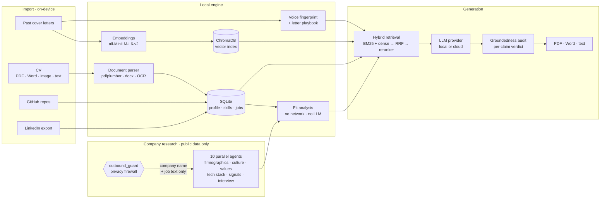

<div align="center">


<h1>Cover Letter Local</h1>

**A job-application assistant that runs entirely on your machine.**

It reads your CV, learns how *you* write, researches the company, and drafts a cover
letter in your own voice — without your personal data ever leaving the device.

[](https://github.com/mehmeterguden/Microsoft-Internship-Cover-Letter-Local/actions/workflows/ci.yml)
[](LICENSE)
[](https://www.python.org/)
[](https://react.dev/)
[](#privacy-what-actually-leaves-your-device)

</div>

---

## The problem

Every AI cover-letter tool asks for the same thing first: **upload your CV**. That means
your full employment history, contact details, and salary-adjacent context land on
someone else's server — to be logged, retained, and possibly trained on.

Cover Letter Local takes the opposite position. The model runs **on your machine**. Your
CV is parsed on-device, your writing style is learned on-device, and the retrieval index
lives in a local database. The only thing that ever goes out is a **company name and the
employer's own job text** — and a privacy firewall inspects every outbound byte to prove it.

<div align="center">

<sub><i>A finished draft — grounded in the real profile, verified claim by claim, exportable to PDF or Word.</i></sub>
</div>

---

## What it does

<table>
<tr>
<td width="50%" valign="top">

### 📄 Turns a CV into a real profile

Drop a **PDF, Word doc, image, or text file**. It's parsed on-device (pdfplumber ·
python-docx · Tesseract OCR), then structured by the model into skills, roles, education,
and projects — **streaming as JSON, field by field**, so you watch it fill in and can edit
anything before it's saved.

</td>
<td width="50%" valign="top">

### 🎙️ Learns how you actually write

Add cover letters you've written before. The model reverse-engineers a **voice
fingerprint**: tone, formality, signature phrases, vocabulary — plus a reusable
**playbook** of the ordered moves you make to open, build an argument, and close. Letters
you rate highly become the gold standard; low-rated ones feed the avoid-list.

</td>
</tr>
<tr>
<td width="50%" valign="top">

### 🔍 Researches the company with an agent fleet

Ten workers run **in parallel** — firmographics, culture, values, tech stack, hiring
signals, role analysis, interview prep — streaming their progress and citing every source
as they find it. Then a **fit analysis runs locally**, with no network and no model, so
the one step that touches your CV physically cannot leak it.

</td>
<td width="50%" valign="top">

### ✍️ Writes in your voice, then checks its own work

Generation streams token by token from your chosen model. A second pass audits **every
concrete claim** against your real profile and returns a per-claim verdict — supported,
partly, or unsupported — so you can see exactly which lines the model invented, and revise
only those.

</td>
</tr>
</table>

Also included: **GitHub import** (public repos → skills and projects), **LinkedIn import**,
an **AI profile interview** that fills gaps by asking you questions, a local **PII scan**
before export, and **PDF / Word export** with a proper business-letter layout.

---

## See it

<div align="center">


<sub><i><b>Writing Voice</b> — the fingerprint, and the memorized opening / body / closing playbook.</i></sub>

<br><br>


<sub><i><b>Profile &amp; Skills</b> — everything the CV import extracted, fully editable, with self-ratings.</i></sub>

</div>

<details>
<summary><b>More screens</b> — company research · CV import · providers · dashboard</summary>
<br>

| | |
|:--:|:--:|
|  |  |
| **Company Research** — ten agents, live sources | **Add CV** — parsed on-device, structured live |
|  |  |
| **Settings** — seven providers, local or cloud | **Home** — pipeline status at a glance |

</details>

---

## Privacy: what actually leaves your device

<div align="center">

</div>

| Data | Where it goes |
|---|---|
| Your CV, profile, skills, past letters | **Never leaves the device.** Parsed, embedded, and stored locally. |
| Embeddings + vector index | **Local** — `sentence-transformers` + ChromaDB on disk. |
| Fit score, match breakdown, letter hooks | **Local** — computed with no network and no model at all. |
| Prompts + generated letters | Stay local with **Foundry Local / Ollama / LM Studio**. Go to the vendor only if *you* pick a cloud provider. |
| Company research queries | Company name, role title, and the employer's public job text — **never your CV**. |

Two mechanisms enforce this rather than merely documenting it:

- **`outbound_guard`** — a single choke point every outbound request passes through. Before
  a request leaves, it scans the exact bytes for your private identifiers (name, email,
  phone, handles, CV summary). If any appear, it raises `OutboundLeakError` and sends nothing.
- **PII scan** — a local, regex-based check that flags sensitive identifiers in a draft
  before you export or send it.

> **On cloud providers.** Choosing OpenAI, Claude, Gemini, or Azure in Settings is an
> explicit opt-in, and the UI says so plainly at the point of choice. The local providers
> remain the default.

---

## Install from the Stable release

If you just want to **run the app**, use the single moving GitHub release instead of
cloning the repo. The release page always stays the same and is updated in place after
successful pushes to `main`.

**Release page:** [Stable](https://github.com/mehmeterguden/Microsoft-Internship-Cover-Letter-Local/releases/tag/stable)

**What to download**

- `cover-letter-local-stable-bundle.tar.gz` — the packaged app bundle
- `cover-letter-local-stable-bundle.zip` — the same bundle in ZIP form
- `SHA256SUMS.txt` — optional checksum file

**Prerequisite:** [Docker Desktop](https://www.docker.com/products/docker-desktop/) or a
local Docker Engine with `docker compose`.

**Run it**

`.tar.gz` path:

```bash
tar -xzf cover-letter-local-stable-bundle.tar.gz
cd cover-letter-local-stable-bundle
docker compose up --build
```

`.zip` path:

```bash
unzip cover-letter-local-stable-bundle.zip
cd cover-letter-local-stable-bundle
docker compose up --build
```

Then open **[http://localhost:8080](http://localhost:8080)**.

**What gets persisted**

- Your database, Chroma index, settings, and generated local state live in `runtime-data/`
- You can keep that folder when you update to a newer stable bundle

**How updates work**

- There is intentionally **one** GitHub release: `Stable`
- New updates replace the assets on that same release page
- The `stable` tag moves to the newest verified `main` commit
- You do **not** need to hunt for `v1`, `v2`, `v3` release pages

---

## Manual development setup

If you want to develop on the project instead of just running it, clone the repository
and start the backend and frontend separately.

**Prerequisites:** Python 3.11+, Node 18+, and a local model runtime
([Foundry Local](https://github.com/microsoft/Foundry-Local) or
[Ollama](https://ollama.com)). Optional: `tesseract` for image OCR.

```bash
git clone https://github.com/mehmeterguden/Microsoft-Internship-Cover-Letter-Local.git
cd Microsoft-Internship-Cover-Letter-Local
```

**1 · Backend**

```bash
cd backend
python -m venv venv && source venv/bin/activate    # Windows: venv\Scripts\activate
pip install -r requirements.txt
uvicorn main:app --reload                          # → http://localhost:8000
```

**2 · Frontend** (new terminal)

```bash
cd frontend
npm install
npm run dev                                        # → http://localhost:5173
```

**3 · Pick a model.** Open **Settings → Model & inference** and choose a provider. There is
no `.env` to edit — provider, model, and keys live in the local database, so you can change
them from the UI at any time.

Then: add your CV → paste a past letter or two → run research on a company → generate.

---

## Troubleshooting

- `docker compose up --build` fails immediately: make sure Docker Desktop or Docker Engine is running
- The UI opens but generation does not work: open **Settings** and pick a valid local or cloud model provider
- OCR does not work in a manual local install: install the `tesseract` binary on your machine
- Port `8080` is busy: run `APP_PORT=3000 docker compose up --build` and then open `http://localhost:3000`
- You want a clean update from the Stable release: download the newest bundle from the same release page and keep your old `runtime-data/` folder if you want to preserve local state

---

## How it works



### Retrieval, specifically

Dense embedding search alone misses exact terms; BM25 alone misses paraphrases. Retrieval
fuses both rankings with **Reciprocal Rank Fusion**, then optionally re-orders the
shortlist with a **cross-encoder reranker**. Every piece is local, and each degrades to a
no-op rather than breaking when a model isn't available.

### Providers, specifically

One interface, seven backends — the app calls `llm.complete()` / `llm.stream()` and the
gateway resolves the provider from settings on every call, so switching takes effect
immediately. That gateway is also the single metering point: every call is timed and
recorded (provider, model, estimated tokens, latency, estimated cost).

| Local | Cloud (opt-in) |
|---|---|
| Microsoft **Foundry Local** *(default)* · **Ollama** · **LM Studio** | **Azure AI Foundry** · **OpenAI** · **Claude** · **Gemini** |

---

## Tech stack

**Backend** — Python 3.11+ · FastAPI · Uvicorn · Pydantic v2 · SQLite · ChromaDB ·
sentence-transformers · pdfplumber · python-docx · reportlab · pytesseract · trafilatura

**Frontend** — React 19 · TypeScript (strict) · Vite · Tailwind CSS v4 · Zustand ·
React Router · Radix UI · Motion · axios

**Notably not used:** LangChain and LlamaIndex. The RAG pipeline, agent orchestration, SSE
streaming, and provider abstraction are built directly — the point was to understand each
layer, not to wire together someone else's.

---

## Project structure

```
backend/
├── api/routers/         26 routers — cv · style · research · cover_letter · settings · …
├── core/
│   ├── llm/             7 providers behind one interface + metering gateway
│   ├── research/        orchestrator · 9 agents · 9 tools (incl. MCP) · outbound_guard
│   ├── prompts/         prompt builders, one module per task
│   ├── style.py         voice learning — rating-weighted, incremental
│   ├── verification.py  groundedness audit + targeted revision
│   ├── rerank.py        BM25 · RRF · cross-encoder
│   └── pii.py           local PII scanner
├── db/                  schema + queries (SQLite)
└── tests/               30 test modules

frontend/src/
├── pages/               11 routes
├── components/          design-system primitives + feature components
├── api/                 typed client, one module per router, SSE helpers
└── lib/, store/         hooks, utilities, Zustand slices
```

---

## Tests

```bash
cd backend && pytest -q
```

CI runs the backend suite plus a full frontend type-check and build on every push and PR.
Coverage focuses on the parts where correctness isn't obvious: the privacy firewall, PII
detection, agent orchestration and caching, research resilience, retrieval fusion, the
provider gateway, and document parsing.

---

## Contributing

Feature branch → PR → **squash-merge**; never commit straight to `main`. Commits follow
[Conventional Commits](https://www.conventionalcommits.org/) in English. Enable the hooks
once after cloning:

```bash
git config core.hooksPath .githooks
```

---

## License

[MIT](LICENSE)

<div align="center">
<br>
<sub>Built as a Microsoft internship project — an experiment in how much of a genuinely useful AI product can run without sending your data anywhere.</sub>
</div>
