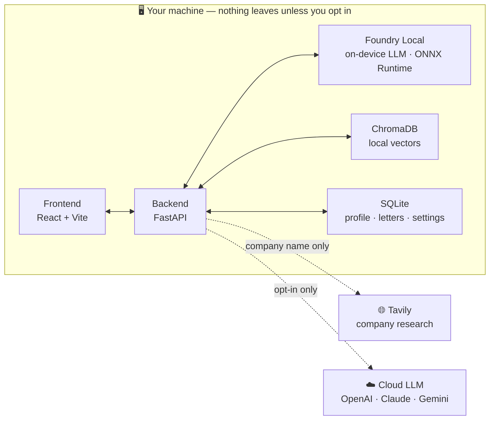

# Cover Letter Local

A privacy-first, fully local AI job-application assistant. Learns your writing
style, profiles your skills, researches companies, and generates personalized
cover letters — all running on your own machine.

> 🚧 **Early development.** Being built step by step. This README will be filled
> in (setup, screenshots, usage) once there's something to run.

## Stack

Python · FastAPI · ChromaDB · local LLM (Microsoft Foundry Local) · React · Vite · TypeScript

## Architecture

Everything runs on your machine. The only data that ever leaves is a **company name**
for research — and prompts *only if you deliberately opt in* to a cloud model.

## Local by default — Microsoft Foundry Local

Cover Letter Local runs its models **on your device** through
[Microsoft Foundry Local](https://learn.microsoft.com/azure/ai-foundry/foundry-local/),
which serves optimized models on the **ONNX Runtime** behind an OpenAI-compatible API —
no API key, no account, no cloud round-trip. List, download, and select a model right from
**Settings → Language model**; the app talks to it over `localhost` and shows a live
"connected & healthy" indicator.

Because inference is local, your CV, profile, and letters stay on the machine that
generated them. The only data that ever leaves is a **company name** for research (via
Tavily), and prompts *only if you deliberately switch to a cloud provider* (OpenAI, Claude,
or Gemini) in Settings. Ollama is supported as an alternative local backend; the defaults
keep you fully offline.

## Responsible AI

Cover Letter Local is built to Microsoft's [Responsible AI Standard](https://www.microsoft.com/en-us/ai/responsible-ai)
and maps to its six principles — Accountability, Transparency, Fairness, Reliability &
Safety, Privacy & Security, and Inclusiveness. In practice that means: **local by
default** (your CV, profile, and letters stay on your device), **per-field provenance**
(every fact is tagged with its source), AI output that is disclosed and **always yours
to review**, and a **privacy firewall** that lets only a company name leave the machine —
failing closed if anything private might leak. We are equally explicit about the limits
(models can err, cloud providers are an opt-in, no formal RAI assessment has been done).

See the in-app **Responsible AI** page (`/responsible-ai`) and the full write-up in
[`docs/RESPONSIBLE_AI.md`](docs/RESPONSIBLE_AI.md).

## License

MIT — see [LICENSE](LICENSE).
