<div align="center">

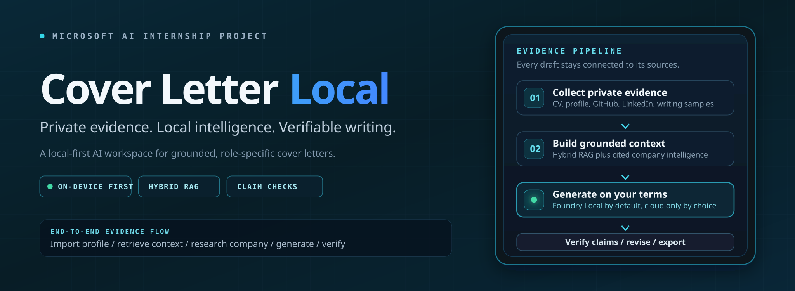

<br>

[](https://github.com/mehmeterguden/Microsoft-Internship-Cover-Letter-Local/actions/workflows/ci.yml)
[](https://github.com/mehmeterguden/Microsoft-Internship-Cover-Letter-Local/releases/tag/stable)
[](https://github.com/microsoft/Foundry-Local)
[](#privacy-and-data-boundaries)
[](https://www.python.org/)
[](https://react.dev/)
[](LICENSE)

**An end-to-end AI engineering project independently developed from scratch during my Microsoft AI internship.**

Cover Letter Local turns a CV, professional profile, writing samples, and public company
information into an evidence-backed cover letter. It combines hybrid RAG, local inference,
parallel company research, streaming AI interfaces, and claim-level verification in one
privacy-conscious application.

[Download Stable](https://github.com/mehmeterguden/Microsoft-Internship-Cover-Letter-Local/releases/tag/stable)
·
[Run with Docker](#run-the-stable-release)
·
[Explore the architecture](#architecture)
·
[What I learned](#what-i-learned)

</div>

> [!NOTE]
> This is an independent internship project built during my Microsoft AI internship. It is
> not an official Microsoft product.

<details>
<summary><b>Contents</b></summary>
<br>

- [The internship project](#the-internship-project)
- [Run the Stable release](#run-the-stable-release)
- [How it works](#how-it-works)
- [Product walkthrough](#product-walkthrough)
- [Architecture](#architecture)
- [Privacy and data boundaries](#privacy-and-data-boundaries)
- [Engineering decisions and trade-offs](#engineering-decisions-and-trade-offs)
- [What I learned](#what-i-learned)
- [Development setup](#development-setup)
- [Testing and CI](#testing-and-ci)
- [Limitations](#limitations)

</details>

---

## The internship project

Writing a tailored cover letter repeatedly took more time than I expected. Each application meant
explaining the same background again, finding the relevant parts of my experience, researching a
new company, and trying to keep the result personal without introducing claims I could not support.
That led me to a practical question:

> Why keep rebuilding every cover letter manually when a local application could understand my
> own evidence, research the target company, write in my voice, and avoid inventing details?

I chose to define and build this project independently instead of using one of the suggested
internship project briefs. The goal was not to retrain a model for every application. It was to
create a reusable local system that could maintain a structured profile, derive a writing guide
from past letters, retrieve the most relevant evidence with RAG, and analyze each company when
needed. Although the idea came from my own application process, the workflow is designed for any
applicant who wants a more grounded and reusable way to prepare cover letters.

Turning that idea into a complete application required much more than connecting a text box to an
LLM. The system needed to understand several document formats, reconcile profile data, build a
writing-voice guide, retrieve relevant experience, research a company without exposing private
profile data to public research tools, stream slow operations clearly, and verify the final draft.
This made Cover Letter Local a practical way to learn how retrieval, local inference, orchestration,
privacy, resilience, and user experience fit together in one AI product.

## What this project demonstrates

| Area | Implementation |
|---|---|
| **Hybrid RAG** | BM25 lexical retrieval and local dense retrieval are fused with Reciprocal Rank Fusion, then optionally reranked with a cross-encoder. |
| **Local inference** | Microsoft Foundry Local is the default path, with Ollama and LM Studio also supported. |
| **Provider abstraction** | One metered gateway supports three local and four explicit opt-in cloud providers without restarting the app. |
| **Company intelligence** | Six specialized agents gather public evidence concurrently; reconciliation, caching, retry/backoff, and a shared tool budget keep the run bounded and resilient. |
| **Grounded generation** | The draft is built from local profile context, learned voice, retrieved examples, and a cached company report, then audited claim by claim. |
| **Streaming AI UX** | CV import, LinkedIn import, voice analysis, company research, and letter generation expose real progress instead of hiding local-model latency behind a spinner. |
| **Responsible AI** | Review-before-write imports, field provenance, outbound request inspection, local PII checks, cited research, and visible provider status make system behavior inspectable. |

---

## Run the Stable release

The repository maintains **one moving GitHub release named Stable**. Every successful push to
`main` replaces its bundles and moves the `stable` tag to the latest CI-verified commit. This keeps
one download page instead of accumulating versioned releases.

### Requirements

- [Docker Desktop](https://www.docker.com/products/docker-desktop/) or Docker Engine with Compose
- A configured inference provider
- Internet access for the first image/model download and for company research

### 1. Download and start

Download either bundle from the
[Stable release](https://github.com/mehmeterguden/Microsoft-Internship-Cover-Letter-Local/releases/tag/stable),
extract it, open a terminal in the extracted directory, and run:

```bash
docker compose up --build
```

Open [http://localhost:8080](http://localhost:8080). To stop the application:

```bash
docker compose down
```

The SQLite database and ChromaDB index are stored in `runtime-data/`. Keep that directory when
updating the application if you want to preserve your profile, settings, research cache, and
letters.

Each service is built from its own isolated context. Local databases, credentials, model caches,
test artifacts, and frontend dependencies never enter the Docker build context. The backend image
also installs the CPU-only PyTorch distribution, avoiding an unnecessary CUDA runtime for this
local-first deployment.

> [!IMPORTANT]
> The Stable bundle is a Docker-ready application package, not a native `.dmg`, `.msi`, or
> desktop installer.

### 2. Start a local model

Microsoft Foundry Local is the primary on-device path. Install the CLI using the official
[Foundry Local documentation](https://learn.microsoft.com/en-us/azure/foundry-local/how-to/how-to-use-foundry-local-cli):

```powershell
# Windows
winget install Microsoft.FoundryLocal
```

```bash
# macOS
brew tap microsoft/foundrylocal
brew install foundrylocal
```

Then inspect the available models, run one that fits your hardware, and retrieve the active
service endpoint:

```bash
foundry model list
foundry model run phi-4-mini
foundry service status
```

In Cover Letter Local, open **Settings → Model & inference**, select **Foundry Local**, enter the
endpoint reported by `foundry service status`, select the installed model, and run the connection
test.

When the application runs in Docker, `localhost` inside the backend container means the container
itself. On Docker Desktop, use `host.docker.internal` with the Foundry Local port reported by the
CLI, for example:

```text
http://host.docker.internal:<PORT>/v1
```

Linux Docker users must additionally expose the host gateway or run the backend directly during
development. A local runtime that listens only on host loopback may also reject container traffic;
in that case, run the backend directly or configure the runtime to expose a Docker-reachable
endpoint. Ollama and LM Studio follow the same host-address rule.

### 3. Build your first letter

1. Import your CV and approve the proposed profile changes.
2. Add one or more past letters so the app can learn your writing voice.
3. Create a cover letter from either a job-posting link or manual company, role, and description fields.
4. Optionally run company deep search and answer tailoring questions.
5. Generate, review the claim check, edit, save, or export the letter.

---

## How it works

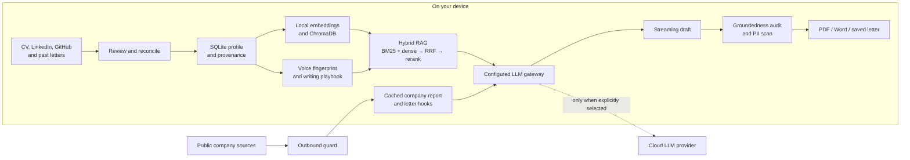

The primary path uses a local model. Public-source research uses the network, and cloud inference
is available only when the user deliberately selects a cloud provider. The exact data boundaries
are documented in [Privacy and data boundaries](#privacy-and-data-boundaries).

## Product walkthrough

### 1. Build a profile from existing evidence

CV, LinkedIn, and GitHub imports end in a review step. The application classifies proposed changes
as fill, same, new, or conflict; nothing is merged into the profile until the user approves it.

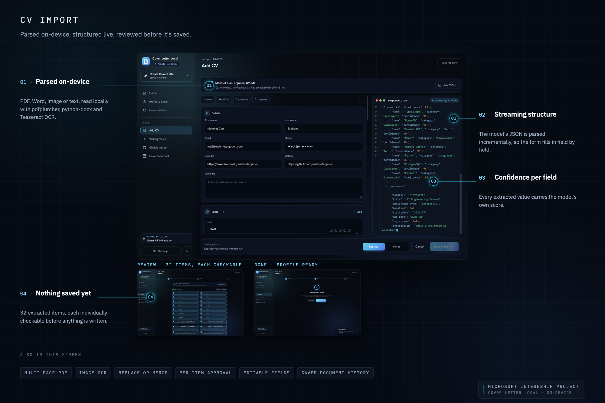

<details>
<summary><b>More profile sources</b></summary>
<br>

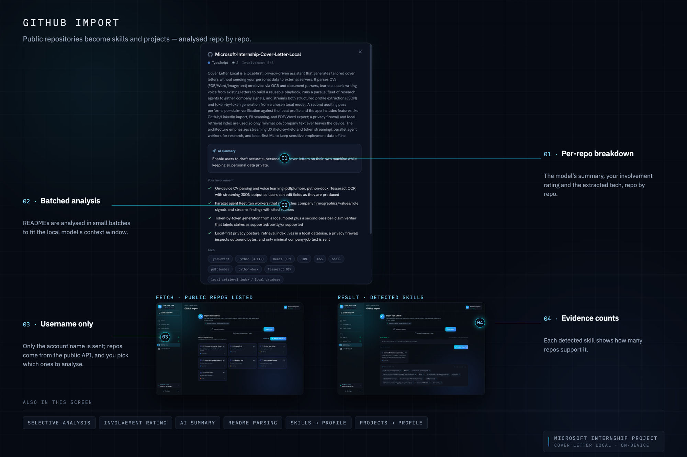

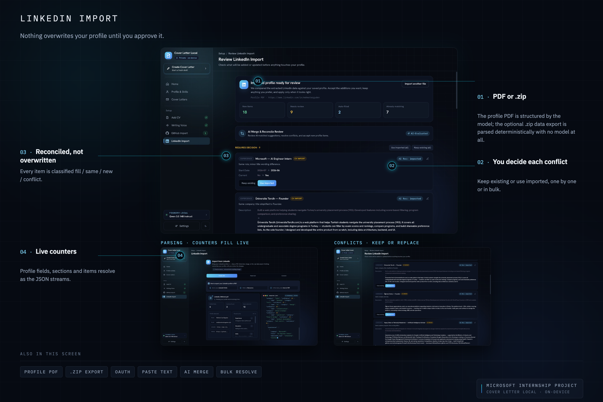

</details>

### 2. Learn a writing voice

Past letters are analyzed into two complementary artifacts: a measurable voice fingerprint and an
ordered writing playbook. User ratings influence the analysis, and later samples refine the existing
profile instead of rebuilding it blindly.

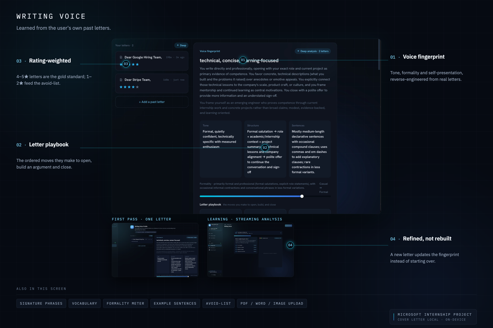

### 3. Import a role and research the company

A job-posting link can populate the company, role, and description automatically; the same fields
can also be entered manually. Deep search runs inside the cover-letter workflow rather than on a
separate research page.

The active research fleet contains six parallel agents:

| Agent | Responsibility |
|---|---|
| Company profile | Firmographics, overview, mission, and values |
| Culture | Workplace and engineering-culture evidence |
| Tech stack | Technologies and open-source signals |
| Recent signals | Current company developments |
| Interview preparation | Evidence-backed interview context |
| Role analysis | Responsibilities and requirements from the job description |

Their outputs are reconciled into one cited report. Two additional stages then run locally:
explainable fit analysis and letter-hook composition.

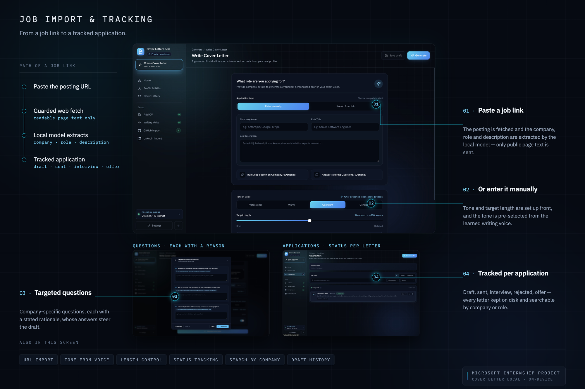

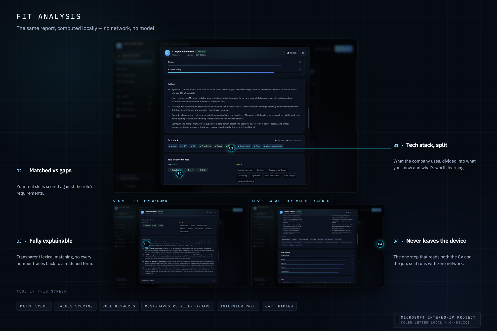

### 4. Retrieve, generate, and verify

The generation prompt combines compact profile evidence, the learned voice guide, role-relevant
past-letter passages, optional tailoring answers, and the cached company report. Tokens stream as
the configured model produces them.

The finished draft can be checked against the local profile. Concrete claims are labelled supported,
partly supported, or unsupported; flagged claims can be revised without rewriting unrelated parts
of the letter. Export to PDF and Word is rendered locally.

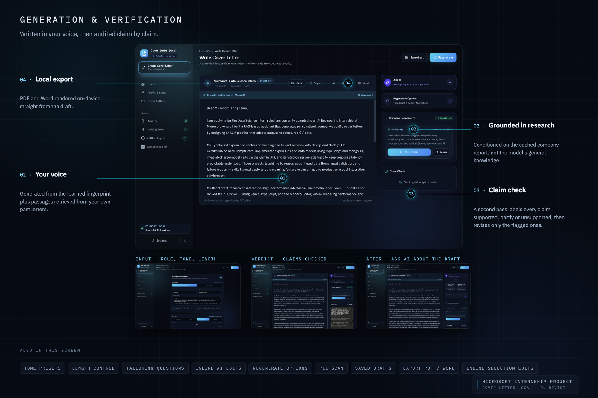

<details>
<summary><b>Profile management and provider controls</b></summary>
<br>

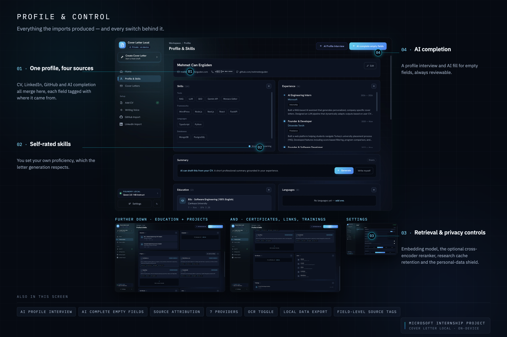

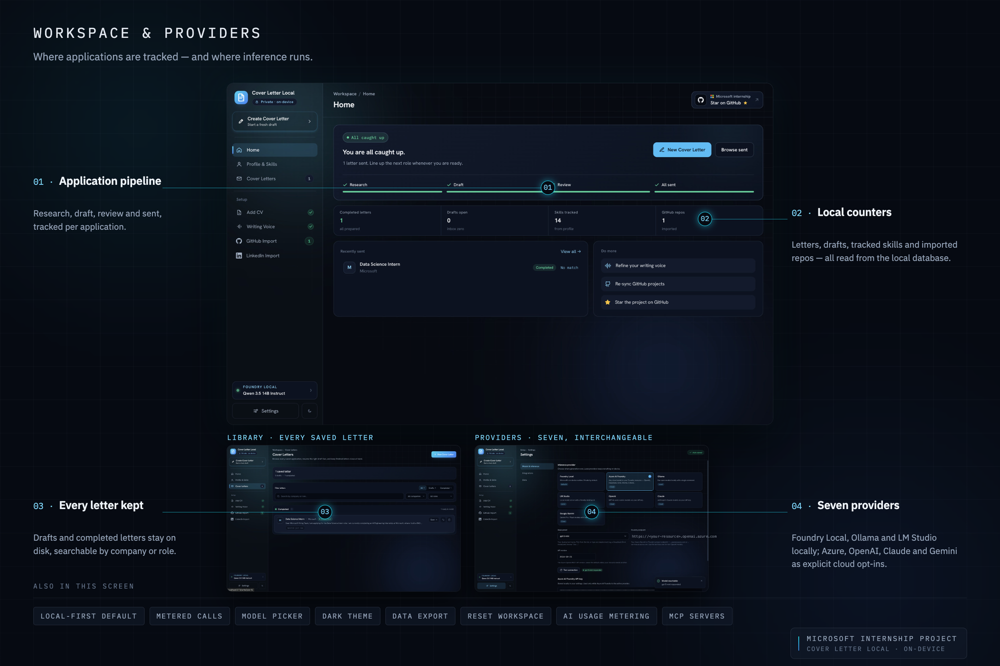

</details>

---

## Architecture

### Application layers

```text
React 19 + TypeScript + Vite
        │
        │ typed REST and Server-Sent Events
        ▼
FastAPI routers
        │
        ├── import and reconciliation
        ├── voice learning and hybrid retrieval
        ├── company research orchestration
        ├── generation, verification, and export
        └── provider discovery, health, and metering
        │
        ▼
SQLite + ChromaDB + local document/model tooling
```

### Retrieval pipeline

The writing-style RAG path is intentionally small enough to inspect:

```text
role + company + job description
              │
              ├── dense retrieval from ChromaDB
              └── BM25 over the local exemplar corpus
                           │
                           ▼
               Reciprocal Rank Fusion
                           │
                           ▼
           optional cross-encoder reranking
                           │
                           ▼
            relevant past-letter passages
```

Dense retrieval captures paraphrases; BM25 preserves exact technologies and role terms. RRF combines
the rankings without requiring comparable score scales. The optional cross-encoder improves
precision and degrades to the fused order if its model is unavailable.

### Research orchestration

The research fleet runs concurrently and streams structured progress through SSE. A shared tool
budget bounds the run; transient failures use retry and backoff; individual agent failures produce
a partial report instead of cancelling the entire workflow. Reports are reconciled, cited, cached
according to the user's retention setting, and can be explicitly refreshed.

Seven built-in public-data tools cover web search, readable-page extraction, Wikidata,
GDELT news, GitHub organizations, Hacker News, and Wikipedia. Optional MCP servers can register
additional tools at startup.

### Inference gateway

| Local providers | Cloud providers — explicit opt-in |
|---|---|
| Microsoft Foundry Local · Ollama · LM Studio | Azure AI Foundry · OpenAI · Claude · Gemini |

Provider, endpoint, model, and credentials are read from the local settings database on each call,
so the active route can change from the UI without restarting the application. Health checks,
installed-model discovery, latency, estimated token counts, and estimated cost are surfaced through
the same gateway.

---

## Privacy and data boundaries

“Local-first” is a default and an architectural option, not a claim that every feature is
network-free. The behavior depends on the feature and the provider the user selects.

| Feature | What can leave the device |
|---|---|
| CV and LinkedIn file import | The file is parsed locally. Structuring uses the configured LLM, so it remains on-device with a local provider and reaches the selected vendor with a cloud provider. |
| Profile, skills, past letters, and saved letters | Stored in local SQLite and ChromaDB. They are not sent by public-source research tools. |
| Embeddings | Produced locally through sentence-transformers or Foundry Local. The default sentence-transformer model downloads once, then runs offline. |
| GitHub import | The username, optional token-authenticated API requests, and public repository content are requested from GitHub. AI analysis follows the configured LLM provider. |
| Job import | The public job-posting URL is fetched so its text can be extracted locally. |
| Company research | Public company, role, job, and source queries pass through `outbound_guard`. The applicant profile is not part of the research input. |
| Cover-letter generation | Prompt context remains local with Foundry Local, Ollama, or LM Studio. It is sent to the selected vendor when a cloud provider is explicitly chosen. |
| Export | PDF and Word files are rendered on-device. |

### Enforcement

**`outbound_guard`** is the shared HTTP boundary for built-in research tools. It uses a public-data
input model and scans the exact outgoing URL or request body for strong private identifiers from
the local profile. A match raises `OutboundLeakError` before the request is sent.

**Claim verification** compares the draft with local profile evidence and the cached company report.
It makes unsupported or partly supported claims visible instead of treating fluent output as truth.

**PII scan** runs locally before export and can flag sensitive identifiers according to the user's
selected sensitivity.

**Review-before-write imports** keep extracted profile changes provisional until the user accepts
them. Field provenance records where imported information came from.

> [!WARNING]
> The application is designed for one user on a trusted machine. It has no authentication layer and
> should not be exposed directly to the public internet. Provider credentials are stored locally in
> the SQLite settings database; the database is not an encrypted secrets vault.

---

## Engineering decisions and trade-offs

<details open>
<summary><b>Build the RAG pipeline directly instead of hiding it behind a framework</b></summary>
<br>

The retrieval path is compact: chunk, embed, retrieve, rank, fuse, optionally rerank. Implementing
those steps directly made prompt context and retrieval failures observable, at the cost of writing
the provider gateway, SSE plumbing, and incremental parsing in the project itself.

</details>

<details>
<summary><b>Fuse lexical and semantic retrieval</b></summary>
<br>

Dense retrieval handles semantic similarity, while BM25 preserves exact framework, product, and
role terms. Combining both rankings with RRF lets the pipeline use these complementary signals.
The cross-encoder remains optional because it adds another first-use model download and more
latency.

</details>

<details>
<summary><b>Keep fit analysis deterministic and local</b></summary>
<br>

Fit analysis is the point where a private profile and a target role meet. It therefore uses
normalized lexical matching and an alias table rather than a network service or LLM. This is less
semantically flexible, but every score can be traced to a matched or missing term.

</details>

<details>
<summary><b>Treat verification as part of generation</b></summary>
<br>

A fluent cover letter can still contain an invented achievement. The application performs a second
pass that evaluates concrete claims against known evidence and supports targeted revision. This
adds latency, but it addresses the most consequential failure mode directly.

</details>

<details>
<summary><b>Stream structured operations, not only prose</b></summary>
<br>

Local models can take time to structure a CV or LinkedIn profile. The frontend renders partial JSON,
live counters, and provisional fields while tokens arrive. A tolerant parser repeatedly recovers the
largest valid JSON prefix, making model latency visible and useful rather than ambiguous.

</details>

<details>
<summary><b>Make research partial-failure tolerant</b></summary>
<br>

Public sources are unreliable. Agents run independently, tools fail soft, transient errors retry
with backoff, a shared budget limits total calls, and completed sections survive when another agent
fails. The result can be explicitly marked partial instead of disappearing.

</details>

---

## What I learned

Before this internship project, I had not built a RAG pipeline, worked with embeddings, or used
Microsoft Foundry Local. Developing Cover Letter Local gave me a practical introduction to these
areas and helped me understand how their individual pieces connect inside a complete application.
My strongest prior experience was in general software development, including React; the largest
learning curve in this project was the AI engineering layer.

### Building a RAG pipeline

Implementing the writing-style retrieval path taught me that RAG is not a single database call.
Documents must be prepared, embedded, stored, retrieved, ranked, and converted into useful prompt
context. I learned why lexical matching and semantic similarity solve different retrieval problems,
how Reciprocal Rank Fusion combines their rankings, and where optional reranking fits into the
pipeline.

### Understanding embeddings and retrieval context

Working with embeddings for the first time made semantic retrieval concrete. The project uses local
embeddings and ChromaDB to find related writing examples, while BM25 protects exact role and
technology terms. Building this flow helped me understand that model output depends not only on the
model, but also on which evidence is retrieved, how much context is supplied, and how clearly that
context is structured.

### Working with Microsoft Foundry Local

This was my first project with Microsoft Foundry Local. I learned how a local model runtime is
discovered, configured, health-checked, and used through an OpenAI-compatible interface. I also
learned that local inference affects the whole product: model availability, downloads, hardware
limits, dynamic endpoints, and latency all need to be represented clearly in the interface.

### Designing around AI latency and incomplete output

Building streaming flows for document import, research, and generation taught me to design for
partial output rather than only a final response. Streamed JSON may be temporarily invalid, local
models may respond slowly, and individual operations may fail. Incremental parsing, visible progress,
retry behavior, and reviewable intermediate state make those conditions understandable to the user.

### Coordinating specialized research agents

The company-research workflow gave me practical experience with a multi-agent design. I learned why
agents need distinct responsibilities, bounded tools, shared budgets, source tracking, caching, and
reconciliation. Running tasks concurrently is only one part of the design; their partial results and
failures also need to be combined into one usable report.

### Grounding and privacy are architectural concerns

The project taught me to treat privacy and groundedness as system design problems. Public company
research should not receive a private profile, cloud inference should be an explicit choice, and
imported data should be reviewed before it becomes authoritative. Claim-level verification also
showed me how an interface can expose whether generated statements are supported instead of asking
the user to trust fluent text automatically.

Building Cover Letter Local during my Microsoft AI internship gave me the opportunity to connect
these new AI concepts in one end-to-end product. More importantly, it helped me understand the logic
behind RAG, embeddings, local models, provider integration, research orchestration, streaming, and
verification by seeing how they behave together in a working application.

---

## Development setup

Use this path when changing the application rather than running the packaged Stable release.

### Requirements

- Python 3.12 recommended; 3.11 or newer supported
- Node.js 20 recommended
- A running local model, or credentials for an explicitly selected cloud provider
- Optional: Tesseract for image OCR

```bash
git clone https://github.com/mehmeterguden/Microsoft-Internship-Cover-Letter-Local.git
cd Microsoft-Internship-Cover-Letter-Local
```

### Backend

```bash
cd backend
python -m venv venv
source venv/bin/activate
python -m pip install --upgrade pip
pip install -r requirements.txt
uvicorn main:app --reload
```

On Windows PowerShell, activate the environment with:

```powershell
.\venv\Scripts\Activate.ps1
```

The API runs at [http://localhost:8000](http://localhost:8000).

### Frontend

Open another terminal from the repository root:

```bash
cd frontend
npm ci
npm run dev
```

The application runs at [http://localhost:5173](http://localhost:5173).

No provider `.env` file is required. Configure the provider, endpoint, model, and credentials from
**Settings → Model & inference**.

---

## Technology

**Backend:** Python · FastAPI · Pydantic · Uvicorn · SQLite · ChromaDB ·
sentence-transformers · pdfplumber · python-docx · reportlab · pytesseract · trafilatura

**Frontend:** React 19 · TypeScript · Vite · Tailwind CSS v4 · Zustand · React Router ·
Radix UI · Motion · axios

**AI and retrieval:** Microsoft Foundry Local · Ollama · LM Studio · Azure AI Foundry · OpenAI ·
Claude · Gemini · BM25 · Reciprocal Rank Fusion · cross-encoder reranking

## Project structure

```text
backend/
├── Dockerfile            production API image
├── api/routers/          HTTP and SSE endpoints
├── core/
│   ├── llm/              provider implementations and metered gateway
│   ├── research/         agents, tools, orchestration, fit, hooks, and outbound guard
│   ├── prompts/          task-specific prompt builders
│   ├── style.py          voice learning and exemplar retrieval
│   ├── rerank.py         BM25, RRF, and cross-encoder helpers
│   ├── verification.py   groundedness audit and targeted revision
│   ├── document_parser.py
│   └── pii.py
├── db/                   SQLite schema and query layer
└── tests/                backend behavior and privacy tests

frontend/
├── Dockerfile            multi-stage web image
├── nginx/                SPA hosting and API proxy
└── src/
    ├── pages/            product workflows
    ├── components/       shared UI and review components
    ├── api/              typed clients and SSE helpers
    ├── store/            Zustand state
    └── lib/              parsing, navigation, theme, and utilities

compose.yml               one-command local stack
```

## Testing and CI

Run the backend suite:

```bash
cd backend
pytest -q
```

Verify the frontend:

```bash
cd frontend
npm ci
npm run typecheck
npm run build
```

CI executes the backend suite and a production frontend build on every push to `main` and every pull
request. A successful `main` run triggers the workflow that rebuilds the single Stable release.

Coverage is concentrated around privacy enforcement, PII detection, research orchestration and
resilience, retrieval ranking, provider behavior, document parsing, reconciliation, generation,
verification, and export.

## Limitations

- Local generation speed and output quality depend on the selected model and hardware.
- Foundry Local is evolving, and its service endpoint can change between runs; use
  `foundry service status` instead of assuming a fixed port.
- The default sentence-transformer and optional cross-encoder need a first-use model download.
- Company research depends on public sources and can return a partial report when sources are
  unavailable or rate-limited.
- Deterministic fit analysis favors explainability and privacy over full semantic matching.
- Cloud providers receive the prompt context required for the selected action.
- The application is single-user, has no authentication, and is intended for a trusted local machine.
- Provider credentials are stored locally in SQLite and are not protected by a dedicated secret vault.

---

## License

[MIT](LICENSE)

<div align="center">
<br>
<sub>
Built by <a href="https://github.com/mehmeterguden">Mehmet Can Ergüden</a>
during a Microsoft AI internship.
</sub>
<br>
<sub>Independent internship project · Not an official Microsoft product</sub>
</div>
